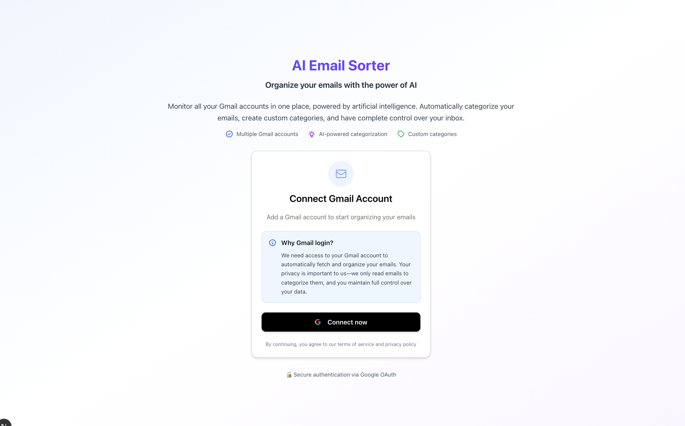
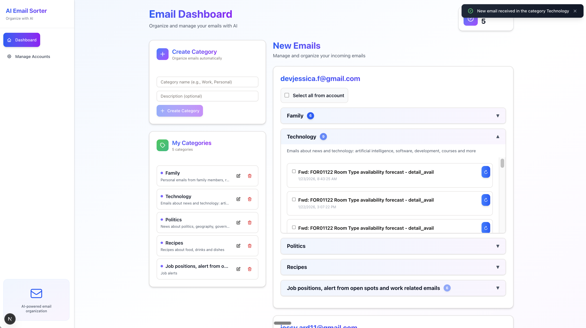
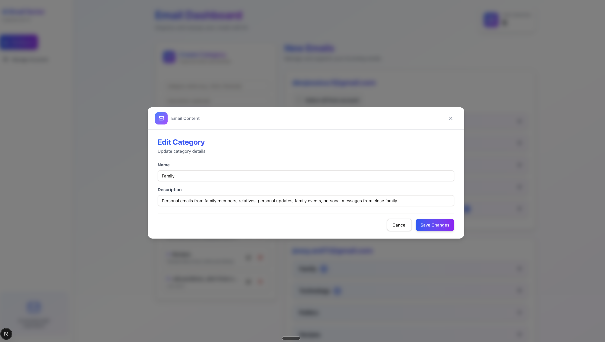
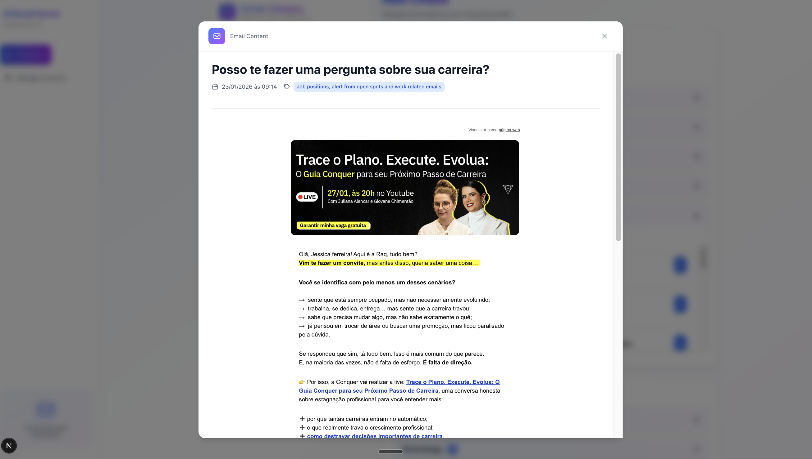
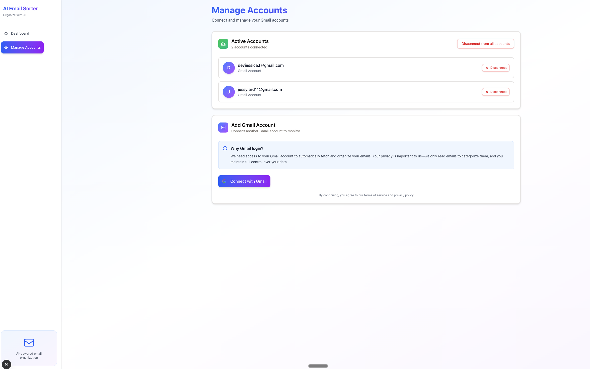

# AI Email Sorter - Frontend

A Next.js application that organizes your Gmail inbox using AI-powered categorization. Connect multiple Gmail accounts, create custom categories, and manage your emails from a unified dashboard.

**Live demo:** [ai-email-sorter-frontend.vercel.app](https://ai-email-sorter-frontend.vercel.app)

> **Note:** This is a prototype project. Real-time email notifications via WebSocket require a Redis instance, which is not provisioned in production due to infrastructure costs. To test the full feature set (including live email streaming), run the project locally with the backend.

## Screenshots

### Login
Connect your Gmail accounts securely via Google OAuth.



### Dashboard
View and manage all your categorized emails from multiple Gmail accounts.



### Edit Category
Customize your categories with names and descriptions to fine-tune AI sorting.



### Email Content
Read the full content of any email directly within the app.



### Manage Accounts
Connect multiple Gmail accounts and manage them from a single page.



## Tech Stack

- **Next.js 15** (App Router)
- **React 19**
- **TypeScript**
- **Tailwind CSS 4**
- **WebSocket** for real-time email notifications

## Prerequisites

- Node.js >= 18
- The [backend](https://github.com/iamjessicaferreira/ai-email-sorter-backend) running locally

## Local Setup

1. **Clone the repository**

```bash
git clone https://github.com/iamjessicaferreira/ai-email-sorter-frontend.git
cd ai-email-sorter-frontend
```

2. **Install dependencies**

```bash
npm install
```

3. **Configure environment variables**

```bash
cp .env.example .env.local
```

Edit `.env.local`:

```env
NEXT_PUBLIC_BACKEND_URL=http://localhost:8000
NEXT_PUBLIC_BACKEND_WS_URL=ws://localhost:8000
```

4. **Start the development server**

```bash
npm run dev
```

The app will be available at [http://localhost:3000](http://localhost:3000).

## How It Works

1. Connect one or more Gmail accounts via Google OAuth
2. Create custom categories (e.g., "Work", "Finance", "Newsletters")
3. The backend uses AI to automatically categorize incoming emails
4. New emails appear in real-time via WebSocket (requires Redis on the backend)
5. Manage emails: view, recategorize, delete, or unsubscribe in bulk

## Project Structure

```
src/app/
  page.tsx                  # Main dashboard
  login/page.tsx            # Google OAuth login
  manage-accounts/page.tsx  # Account management
  components/               # UI components
  utils/                    # Utilities (fetch, cookies, context)
```

## Related

- [Backend repository](https://github.com/iamjessicaferreira/ai-email-sorter-backend)
